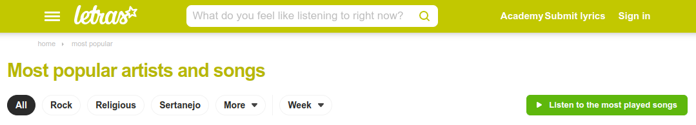

# CKP9011 - Introdução a Ciência de Dados
  

## Scrapping

[Letras.com](https://www.letras.com/) é uma plataforma que disponibiliza letras e traduções de letras de diferentes gêneros musicais e línguas. A plataforma disponibiliza uma lista dinâmica das 1000 músicas mais populares.

A qualquer instante a lista de músicas pode ser alterada. Um arquivo com a rotina de _scrapping_ está disponível neste repositório ([notebook](./scrapping/letras-com-scrapping.ipynb)).

## Dados

Até o momento os dados brutos contam com as seguinte colunas ([dados](./data/letras-com.csv)).

| # | Nome     | Tipo    | # | Nome     | Tipo    |
| - | -------- | ------- | - | -------- | ------- |
| 0 | `rank`   | int64   | 5 | `genre`  | object  |
| 1 | `singer` | object  | 6 | `lang`   | object  |
| 2 | `title`  | object  | 7 | `views`  | float64 |
| 3 | `url`    | object  | 8 | `lyrics` | object  |
| 4 | `album`  | object  |

## Notas
Este repositório foi criado para documentar o progresso nos trabalhos da disciplina _CKP9011 - Introdução a Ciência de Dados_ da Universidade Federal do Ceará.

